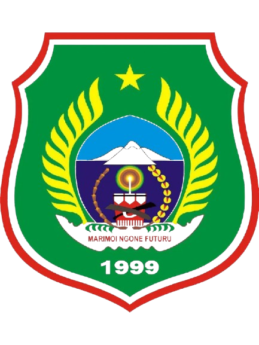

<p align="center">
    
</p>

<p align="center">
    <a href="https://github.com/yourusername/lms-bpsdm-malut"></a>
    <a href="https://laravel.com"></a>
    <a href="https://opensource.org/licenses/MIT"></a>
</p>

## Tentang LMS BPSDM Malut

LMS (Learning Management System) BPSDM Malut adalah platform pembelajaran digital yang dirancang khusus untuk mendukung
pengembangan kompetensi Aparatur Sipil Negara (ASN) di lingkungan Pemerintah Provinsi Maluku Utara. Sistem ini
menyediakan berbagai fitur untuk memfasilitasi proses pembelajaran yang efektif dan terukur, meliputi:

- **Manajemen Kursus** - Pengelolaan kursus pelatihan dengan struktur modul dan materi yang terorganisir
- **Sistem Ujian & Quiz** - Evaluasi pembelajaran dengan berbagai tipe soal dan penilaian otomatis
- **Tracking Progress** - Pemantauan progres belajar peserta secara real-time
- **Sertifikat Digital** - Penerbitan sertifikat otomatis untuk peserta yang menyelesaikan kursus
- **Multi-role Access** - Sistem berbasis role (Admin, Instruktur, Peserta) dengan hak akses yang terpisah
- **Dashboard Analytics** - Visualisasi data dan statistik pembelajaran
- **API Documentation** - RESTful API dengan dokumentasi lengkap menggunakan Swagger/OpenAPI

## Fitur Utama

### Untuk Peserta
- Akses katalog kursus yang tersedia
- Pembelajaran berbasis modul dengan berbagai tipe konten (video, dokumen, artikel)
- Mengerjakan quiz dan ujian online
- Tracking progres pembelajaran
- Download sertifikat digital

### Untuk Instruktur
- Membuat dan mengelola kursus
- Upload materi pembelajaran (video, dokumen, dll)
- Membuat soal ujian dan quiz
- Monitoring progres peserta
- Memberikan penilaian

### Untuk Admin
- Manajemen pengguna (Admin, Instruktur, Peserta)
- Manajemen OPD (Organisasi Perangkat Daerah)
- Monitoring sistem secara keseluruhan
- Laporan dan analytics
- Pengaturan sistem

## Teknologi

Sistem ini dibangun menggunakan teknologi modern:

- **Backend Framework**: Laravel 11.x
- **Database**: MySQL/PostgreSQL
- **Authentication**: Laravel Sanctum (Token-based API Authentication)
- **API Documentation**: L5-Swagger (OpenAPI 3.0)
- **File Storage**: Laravel Storage (Local/Cloud)
- **Architecture**: Modular Architecture (nWidart/laravel-modules)

## Persyaratan Sistem

- PHP >= 8.2
- Composer
- MySQL >= 8.0 atau PostgreSQL >= 13
- Node.js >= 18.x & NPM (untuk frontend assets)
- Web Server (Apache/Nginx)

## Instalasi

### 1. Clone Repository
```bash
git clone https://github.com/yourusername/lms-bpsdm-malut.git
cd lms-bpsdm-malut
```

### 2. Install Dependencies
```bash
composer install
npm install
```

### 3. Setup Environment
```bash
cp .env.example .env
php artisan key:generate
```

Edit file `.env` dan sesuaikan konfigurasi database:
```env
DB_CONNECTION=mysql
DB_HOST=127.0.0.1
DB_PORT=3306
DB_DATABASE=lms_bpsdm_malut
DB_USERNAME=root
DB_PASSWORD=
```

### 4. Migrasi Database
```bash
php artisan migrate --seed
```

### 5. Storage Link
```bash
php artisan storage:link
```

### 6. Generate Swagger Documentation
```bash
php artisan l5-swagger:generate
```

### 7. Jalankan Aplikasi
```bash
php artisan serve
```

Aplikasi dapat diakses di: `http://localhost:8000`
API Documentation: `http://localhost:8000/api/documentation`

## Default Credentials

### Admin
- Email: `admin@bpsdm-malut.go.id`
- Password: `password`

### Instruktur
- Email: `instruktur@bpsdm-malut.go.id`
- Password: `password`

### Peserta
- Email: `peserta@bpsdm-malut.go.id`
- Password: `password`

**⚠️ PENTING: Segera ubah password default setelah instalasi!**

## Struktur Modul

Aplikasi menggunakan arsitektur modular dengan struktur:
```
Modules/
├── AdminInstruktur/ # Manajemen Admin & Instruktur
├── Peserta/ # Manajemen Peserta
├── OPD/ # Manajemen OPD
├── Kursus/ # Manajemen Kursus
├── Modul/ # Manajemen Modul Kursus
├── Materi/ # Manajemen Materi Pembelajaran
├── Quiz/ # Sistem Quiz
├── Ujian/ # Sistem Ujian
├── Sertifikat/ # Penerbitan Sertifikat
└── Dashboard/ # Dashboard & Analytics
```

## API Documentation

API Documentation tersedia di `/api/documentation` menggunakan Swagger UI.

Endpoint utama:
- `/api/v1/auth/*` - Authentication
- `/api/v1/kursus/*` - Kursus Management
- `/api/v1/modul/*` - Modul Management
- `/api/v1/materi/*` - Materi Management
- `/api/v1/quiz/*` - Quiz Management
- `/api/v1/ujian/*` - Ujian Management
- `/api/v1/sertifikat/*` - Sertifikat Management

## Testing
```bash
php artisan test
```

## Deployment

Untuk deployment ke production:

1. Set environment ke production di `.env`:
```env
APP_ENV=production
APP_DEBUG=false
```

2. Optimize aplikasi:
```bash
php artisan config:cache
php artisan route:cache
php artisan view:cache
```

3. Setup queue worker untuk background jobs:
```bash
php artisan queue:work --daemon
```

## Kontribusi

Kontribusi terhadap pengembangan sistem ini sangat diterima. Silakan buat pull request atau laporkan issue yang
ditemukan.

## Tim Pengembang

Dikembangkan oleh Tim IT BPSDM Provinsi Maluku Utara

## Lisensi

Sistem ini merupakan proyek internal Pemerintah Provinsi Maluku Utara.

## Kontak & Dukungan

Untuk pertanyaan atau dukungan teknis:
- Email: it@bpsdm-malut.go.id
- Website: https://bpsdm.malutprov.go.id

---

© 2026 BPSDM Provinsi Maluku Utara. All Rights Reserved.
